# Wearable Devices as a Context-Sensing Layer for Human–Machine and Human–Robot Interaction in Smart Manufacturing

**Review paper and proposed experimental framework**
**Data status:** all results produced by the accompanying prototype are synthetic/simulated. No human participants, clinical measurements, or deployed factory telemetry were used.

## Abstract

Wearable computing is often discussed as a source of worker health or productivity data, while industrial human–robot interaction (HRI) is often discussed in terms of robot safety, task allocation, and collaborative workcell design. These streams of research overlap, but they do not automatically form a valid context-aware control system. This paper critically reviews the relationship between wearable sensing, industrial augmented reality, ergonomics, context-aware robotics, digital twins, and human-centered manufacturing. It then proposes a hierarchical architecture in which wearable measurements are treated as uncertain contextual evidence rather than direct observations of human intention or medical condition.

A reproducible virtual vehicle-manufacturing testbed is provided. It models logistics, body shop, welding, painting, powertrain, battery/electrical assembly, general assembly, quality inspection, testing, and finished-vehicle dispatch. A continuous event loop generates explicitly synthetic wearable, machine, robot, production, and department-location signals. A confidence-aware context policy compares machine/environment-only control with motion, physiological, smart-glasses/context, and full conditions. The prototype persists normalized event records in SQLite and exposes a Streamlit floor-plan dashboard with cycle control, periodic analytics, SQL querying, and a smart-glasses concept view.

The defensible research gap is narrower than the claim that wearables are absent from manufacturing. Existing work demonstrates individual pieces of the problem: wearable sensing, industrial AR, ergonomics, collaborative robotics, digital twins, or context-aware assistance. The less-established contribution is an openly reproducible, cross-layer evaluation protocol that compares the incremental value of each wearable modality under faults, uncertainty, latency, packet loss, and privacy constraints. The paper therefore proposes an evaluation agenda rather than claiming that wearable assistance necessarily improves productivity.

**Keywords:** wearable computing; smart manufacturing; Human–Machine Interaction; Human–Robot Interaction; human–robot collaboration; worker-state estimation; augmented reality; digital twin; multimodal sensor fusion; industrial ergonomics; Industry 5.0.

## 1. Introduction

Manufacturing systems increasingly combine human operators, robots, machines, sensors, and software services. The production system observes machine state relatively well, but its representation of human state is usually indirect. A worker may be fatigued, overloaded, outside a safety zone, or engaged in a task transition while the robot sees only distance, force, and workcell sensors. Wearables may add evidence about motion, heart rate, skin temperature, posture, workload proxies, location, and interaction events. They do not, however, provide a transparent window into intention, stress diagnosis, or safety.

The scientifically useful question is therefore not “Can a wearable understand a worker?” It is: **Under which conditions does multimodal wearable evidence improve a machine’s estimate of worker state or interaction context enough to justify the added cost, uncertainty, privacy exposure, and operational complexity?** This formulation avoids a common overclaim. A physiological signal can be correlated with effort in one task and confounded by heat, illness, fitness, medication, or individual baseline in another. A smart-glasses event may indicate that an instruction was displayed, not that it was understood.

This paper has two linked goals. First, it reviews the technological landscape and identifies where evidence is mature, where it is experimental, and where an integration claim would be premature. Second, it specifies and executes a reproducible virtual factory experiment in which baseline and wearable-enabled systems can be compared without pretending that synthetic evidence is field evidence.

### Contributions

1. A critical, bounded review of wearable sensing, industrial AR, HMI/HRI, context-aware robotics, digital twins, edge processing, and responsible AI.
2. A hierarchical architecture that separates signal processing, statistical estimation, deterministic safety logic, machine learning, and optional language-model assistance.
3. A ten-department synthetic vehicle-factory model with workers, robots, machines, vehicles, safety zones, failure scenarios, and a continuous event loop.
4. An ablation protocol that tests whether motion, physiology, smart-glasses/context, or full multimodal sensing adds measurable value.
5. A reproducible SQLite schema, Streamlit dashboard, query runner, smart-glasses concept view, and experiment runner.
6. A limitations, ethics, and editorial change log intended to prevent overinterpretation.

## 2. Background

### 2.1 Wearable devices and health-related sensing

Wearables can measure or derive heterogeneous signals: inertial motion, heart rate, heart-rate variability, skin temperature, electrodermal activity, location, button/gesture events, and device status. The measurement quality depends on sensor placement, sampling rate, calibration, motion artifact, individual variation, and task context. “Fatigue index,” “stress index,” and “workload index” should therefore be described as operational estimates unless they have been validated against a defined reference protocol.

A consumer wearable is not automatically a medical device. A factory prototype must not diagnose illness or use a generic heart-rate threshold as a clinical judgment. In this work, physiological values are synthetic features used to test data-flow and control hypotheses.

### 2.2 Industrial wearables and smart glasses

Industrial wearables include wrist devices, body-mounted inertial sensors, smart glasses, voice interfaces, location tags, and devices used for remote assistance or work instructions. Smart glasses can potentially display task steps, machine state, alerts, navigation, or remote expert annotations. The benefit depends on information relevance, latency, field of view, comfort, battery duration, and the risk of visual or cognitive overload. The prototype’s glasses view is explicitly a **concept representation**, not a claim about the capabilities of a particular commercial product.

### 2.3 HMI, HRI, and human–robot collaboration

HMI describes how people exchange information with machines; HRI describes interaction between people and robots; human–robot collaboration (HRC) additionally emphasizes shared work and safety constraints. Collaborative robots should not be made to trust a wearable blindly. A wearable-derived state is one evidence source among robot perception, machine state, workcell geometry, and formal safety controls. The most defensible role for wearable context is to support assistance, prioritization, adaptation, or warning while independent safety-rated mechanisms retain authority over hazardous motion.

### 2.4 Context-aware computing and sensor fusion

Context-aware systems infer a situation from multiple observations and uncertainty. Sensor fusion may be deterministic, statistical, or learned. Fusion should preserve provenance and confidence, because a missing packet and a normal physiological value are not equivalent observations. The prototype records packet loss, device presence, scenario, and context confidence for that reason. The current prototype does not implement an extended Kalman filter, Butterworth filter, REBA scoring, or a 100-Hz transport; these remain proposed extensions rather than reported results.

### 2.5 Digital twins and human digital twins

ISO 23247-1:2021 defines an overview and general principles for a digital-twin framework for manufacturing. A digital twin is more than a dashboard: it requires a defined relationship between a physical entity, its digital representation, data exchange, and use across a lifecycle. The present factory is a **simulation testbed with twin-like state representations**, not a validated digital twin of a physical plant. A human digital twin is an even stronger claim and should be used carefully; this paper uses “worker-state representation” for synthetic estimates.

### 2.6 Human-centered manufacturing

The European Commission’s Industry 5.0 report frames sustainability, human-centricity, and resilience as complements to Industry 4.0. This supports evaluating worker-centered outcomes alongside throughput, but it does not prove that any particular wearable architecture improves them. The evaluation must therefore include false alarms, missed events, latency, context availability, privacy cost, and operator acceptance rather than only production count.

## 3. Review Method and Evidence Discipline

This is a structured critical review and engineering synthesis, not a registered systematic review or meta-analysis. The search plan prioritizes peer-reviewed reviews and primary studies in IEEE Xplore, ACM Digital Library, PubMed, ScienceDirect, Springer, and major proceedings, together with official standards and public technical frameworks. Search concepts combine `(wearable OR smartwatch OR smart glasses OR inertial OR physiological)` with `(manufacturing OR industrial OR worker OR ergonomics)`, `(HMI OR HRI OR collaborative robot OR context-aware)`, and `(digital twin OR edge OR sensor fusion OR streaming)`.

The review reports a claim only when the source supports the relevant level of inference. A conceptual architecture is not counted as a demonstrated industrial deployment. A laboratory classifier is not counted as a validated factory safety system. A synthetic simulation is not counted as empirical human evidence. The current repository does not contain a saved database export from every literature source, so the review should be expanded with a PRISMA-style screening log before journal submission.

### Evidence categories

| Category            | Meaning in this paper                                                                                      |
| ------------------- | ---------------------------------------------------------------------------------------------------------- |
| Demonstrated        | Reported in an experiment, field study, standard, or operational case with a defined method                |
| Supported direction | Multiple studies or authoritative frameworks motivate the claim, but deployment conditions remain variable |
| Proposed            | Architecture or hypothesis that still requires validation                                                  |
| Not established     | The requested inference is too strong or lacks adequate evidence                                           |

## 4. Technological Landscape

### Table 1. Wearable technologies and measurable variables

| Technology                | Direct or proximate variables                         | Appropriate interpretation           | Main limitations                               |
| ------------------------- | ----------------------------------------------------- | ------------------------------------ | ---------------------------------------------- |
| Wrist IMU                 | acceleration, orientation, activity                   | motion/activity evidence             | placement and task dependence                  |
| Smartwatch optical sensor | pulse-related measures, device status                 | physiological proxy                  | motion artifact, skin/contact variation        |
| Chest ECG/PPG sensor      | cardiac intervals and HRV features                    | physiological feature under protocol | electrode/contact burden and calibration       |
| Skin-temperature sensor   | local skin temperature                                | thermal/context indicator            | not core body temperature; ambient sensitivity |
| Smart glasses             | display events, voice, camera/IMU, interaction events | interface and task-context evidence  | distraction, privacy, battery, field of view   |
| RTLS/UWB/BLE tag          | location/proximity estimate                           | spatial context                      | multipath, calibration, infrastructure cost    |
| Environmental sensor      | temperature, noise, lighting, air quality             | workplace context                    | spatial coverage and synchronization           |

### Table 2. Wearable technologies used in HMI/HRI

| Modality           | Potential HMI/HRI use                     | Evidence status in this framework             |
| ------------------ | ----------------------------------------- | --------------------------------------------- |
| Motion             | activity and posture context              | testable synthetic condition                  |
| Physiology         | workload/fatigue indicators               | testable proxy, not diagnosis                 |
| Smart glasses      | task instruction and notification channel | concept view; acceptance requires human study |
| Location/proximity | safety-zone and task-location context     | testable with independent safety sensing      |
| Full multimodal    | context fusion and confidence estimation  | proposed ablation target                      |

### Table 3. Physiological and behavioral indicators

| Indicator          | What it may contribute                    | What it cannot establish alone                |
| ------------------ | ----------------------------------------- | --------------------------------------------- |
| Heart rate         | exertion/context variation                | fatigue or stress diagnosis                   |
| HRV feature        | autonomic proxy under controlled protocol | intention, health status, or universal stress |
| Skin temperature   | thermal/environmental context             | core temperature or heat illness diagnosis    |
| Posture/IMU        | movement and ergonomic exposure           | injury or intent                              |
| Workload proxy     | task demand estimate                      | subjective workload without validation        |
| Device interaction | instruction display/acknowledgment event  | comprehension or consent                      |

### Table 4. Industrial wearable application classes

| Application           | Likely benefit                            | Required validation                            |
| --------------------- | ----------------------------------------- | ---------------------------------------------- |
| Work instructions     | reduced search and hands-busy interaction | task time, error, cognitive load, acceptance   |
| Ergonomic assessment  | exposure mapping                          | reference observation and inter-rater validity |
| Safety-zone awareness | additional context                        | safety-rated independent sensing               |
| Remote assistance     | information access                        | latency, privacy, task outcome                 |
| Workload monitoring   | targeted support                          | individual calibration and fairness analysis   |

### Table 5. Smart-glasses use cases in manufacturing

| Use case            | Interface output          | Main risk                      |
| ------------------- | ------------------------- | ------------------------------ |
| Assembly guidance   | step, part, confirmation  | visual overload                |
| Machine information | state, fault, cycle data  | stale or misleading data       |
| Safety notification | context-aware warning     | alarm fatigue                  |
| Remote expert       | annotated video/voice     | privacy and network dependence |
| Navigation          | route and station context | distraction and location error |

### Table 6. Architectural patterns

| Pattern                  | Strength                         | Weakness                                        |
| ------------------------ | -------------------------------- | ----------------------------------------------- |
| Device-local             | low latency, lower bandwidth     | limited compute and battery                     |
| Edge gateway             | synchronization and local policy | gateway availability and management             |
| Cloud analytics          | historical scale                 | latency, connectivity, data governance          |
| Digital-twin integration | shared state model               | semantic and lifecycle complexity               |
| LLM-assisted interface   | flexible explanation             | nondeterminism; unsuitable as safety controller |

## 5. Critical Research Gap

The literature does support a gap, but not the broad claim that “wearables have not been integrated with manufacturing.” Wearables, industrial AR, ergonomics, HRI, and digital twins each have substantial bodies of work. The defensible gap is narrower:

> There is a need for reproducible, cross-layer evaluation protocols that measure the incremental contribution of wearable modalities to worker-state/context estimation and HMI/HRI decisions under uncertainty, operational faults, latency, privacy constraints, and production trade-offs.

This gap has four dimensions:

1. **Integration:** sensing, context estimation, robot policy, production state, and analytics are often evaluated separately.
2. **Attribution:** multimodal systems make it difficult to determine whether a wearable modality contributes information beyond machine/environment observations.
3. **Robustness:** packet loss, drift, missing devices, delayed data, and conflicting sensors are often secondary concerns rather than primary experimental factors.
4. **Governance:** worker surveillance, consent, data minimization, and access control must be evaluated as system requirements, not appended after deployment.

The proposed contribution is therefore a testbed and protocol, not a claim of universal productivity improvement.

## 6. Proposed Hierarchical Architecture

### Levels

- **Level 0 — Human:** worker, task, consent, and agency.
- **Level 1 — Wearable sensing:** smartwatch/fitness band, smart glasses, IMU, heart-rate/HRV feature source, skin temperature, location, interaction events.
- **Level 2 — Device processing:** filtering, calibration, timestamping, artifact flags, feature extraction, local event detection.
- **Level 3 — Edge/gateway:** BLE/Wi-Fi/MQTT adapter, synchronization, buffering, device management, packet-loss accounting.
- **Level 4 — Context fusion:** wearable, robot, machine, environment, location, production, and schedule streams.
- **Level 5 — Context engine:** worker-state indicators, task state, safety state, machine/robot state, production state, and confidence.
- **Level 6 — Decision/HRI-HMI:** deterministic safety policy, rule-based adaptation, statistical prioritization, optional learned models.
- **Level 7 — Interaction:** robot, machine HMI, supervisor dashboard, smart-glasses interface.
- **Level 8 — Data/analytics:** time-series database, audit log, digital-twin state, periodic evaluation.

### Algorithm placement

Signal filtering and calibration belong at Level 2. Timestamp alignment, buffering, and data-quality checks belong at Level 3. Statistical feature aggregation and sensor fusion belong at Levels 4–5. Safety-rated stop logic must remain deterministic and independent of a speculative wearable inference. Machine learning may estimate activity or worker state when trained and validated for the target population and task. An LLM may summarize events or answer a supervisor’s query, but it should not directly command hazardous robot motion.

### Figure 1. Conceptual relationship between wearable, human, machine, and robot

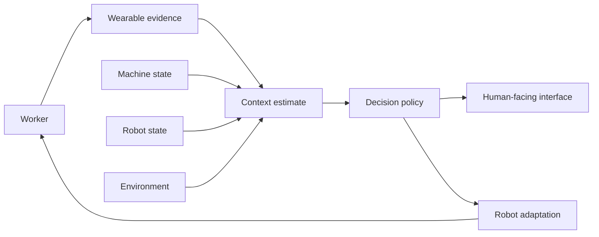

**Caption:** Wearable signals augment, rather than replace, machine, robot, and environmental observations.
**Description:** The context estimate is an uncertain intermediate representation.
**Source:** Author-generated conceptual architecture.

### Figure 2. Hierarchical wearable-to-HRI architecture

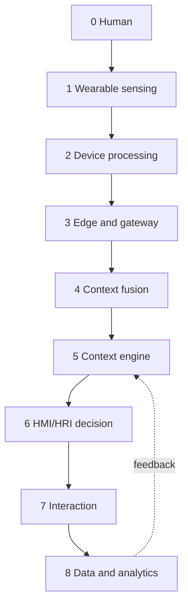

**Caption:** Proposed hierarchy separates measurement, inference, action, and record keeping.
**Source:** Author-generated conceptual architecture.

### Figure 3. Complete data-flow architecture

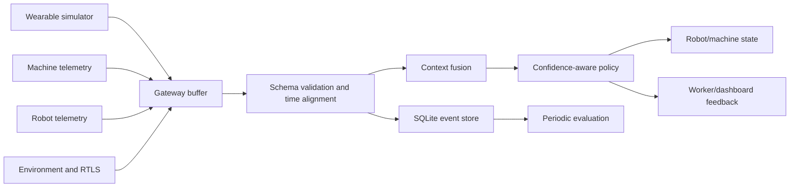

**Caption:** The research prototype uses a local event loop in place of an external broker; the schema is transport-neutral.
**Source:** Author-generated engineering diagram.

## 7. Virtual Vehicle Manufacturing Factory

### Table 7. Factory departments and modeled entities

| Department         | Worker task               | Robot/machine role      | Primary context concern        |
| ------------------ | ------------------------- | ----------------------- | ------------------------------ |
| Raw Logistics      | receiving and kitting     | material transfer       | location and workload          |
| Body Shop          | panel/chassis assembly    | handling and fastening  | physical fatigue               |
| Welding            | weld-cell support         | robotic weld process    | proximity and thermal context  |
| Painting           | coating/curing support    | paint process           | thermal and chemical controls  |
| Powertrain         | drivetrain fitment        | guided installation     | precision and workload         |
| Battery Electrical | battery/HV assembly       | controlled handling     | safety state and authorization |
| General Assembly   | interior, doors, trim     | collaborative fastening | posture and task state         |
| Quality Inspection | visual/dimensional checks | inspection support      | attention and defect context   |
| Testing            | end-of-line tests         | automated test cell     | machine fault and bottleneck   |
| Finished Dispatch  | release and movement      | dispatch handling       | location and production state  |

The simulation represents workers, robots, machines, vehicles, conveyor position, tasks, safety zones, and device status. It does not claim geometric or process fidelity to any particular car manufacturer.

### Figure 4. Virtual factory layout

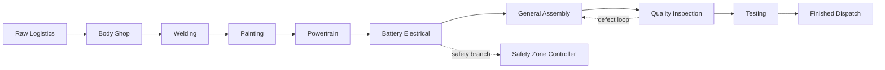

**Caption:** Vehicle progression follows an explicit ten-department process model with safety and rework relationships.
**Source:** Author-generated simulation layout.

## 8. Synthetic Wearable Data and Event Loop

Each simulated sample contains `worker_id`, ISO timestamp, location, department, task, heart rate, HRV feature, skin temperature, acceleration, activity state, posture, fatigue indicator, workload indicator, safety state, machine ID, robot ID, packet-loss state, and device-wearing state. Derived records contain ergonomic risk, safety score, context confidence, robot action, robot speed, machine state, defect flag, and production position. The system labels every run as synthetic. Scenarios include normal operation, fatigue, safety-zone entry, machine fault, workload spike, bottleneck, worker absence, packet loss, sensor drift, and communication latency.

### Figure 5. Real-time streaming pipeline

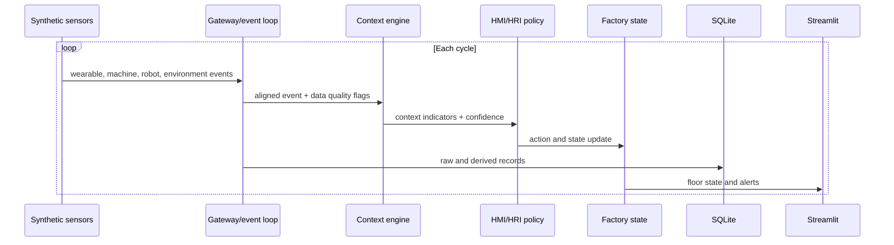

**Caption:** A cycle is a complete sense-to-record transaction; the dashboard advances it with a button.
**Source:** Author-generated architecture.

## 9. Baseline, Wearable Conditions, and Hypotheses

### Baseline model

The baseline receives machine, robot, production, and department-state data. It does not use wearable-derived context for its policy. Independent safety controls remain conceptually available; the baseline is not an unsafe system.

### Wearable-enabled conditions

- `motion`: posture and motion evidence.
- `physiology`: fatigue, workload, stress, heart-rate/HRV features.
- `glasses`: task/display/location interaction context.
- `full`: all simulated modalities with confidence-aware fusion.

### Hypotheses

- **H1:** Wearable conditions improve worker-state/context estimation relative to machine/environment-only data in scenarios where the relevant signal is observable and not missing.
- **H2:** Wearable conditions reduce detection latency for selected simulated events, but may increase false positives under drift or noisy data.
- **H3:** Full multimodal fusion does not necessarily dominate every ablation; additional signals can add cost and conflicting evidence.
- **H4:** Wearable-aware policy changes robot interventions and risk exposure, but productivity improvement is an empirical question rather than an assumption.
- **H5:** Context availability and auditability can improve with wearable data while total context-maintenance cost also increases.

## 10. Evaluation Framework

### Table 8. Metrics and operational definitions

| Metric                    | Operational definition                                                                     | Why it matters                                       |
| ------------------------- | ------------------------------------------------------------------------------------------ | ---------------------------------------------------- |
| Context availability      | valid context samples / expected samples                                                   | missing-data resilience                              |
| Context confidence        | proposed bounded fusion confidence                                                         | exposes uncertainty; not a validated universal score |
| Event precision/recall/F1 | detected versus injected events                                                            | detection quality                                    |
| Detection latency         | decision timestamp minus injected-event timestamp                                          | real-time suitability                                |
| False-positive rate       | false alerts / negative opportunities                                                      | alarm burden                                         |
| Packet loss               | missing wearable packets / expected packets                                                | transport reliability                                |
| Robot response latency    | action timestamp minus decision input                                                      | control responsiveness                               |
| Throughput                | completed vehicles per simulated period                                                    | production effect                                    |
| Cycle time                | station/vehicle elapsed time                                                               | flow efficiency                                      |
| Downtime                  | time unavailable due to fault or policy                                                    | operational cost                                     |
| Ergonomic risk            | proposed weighted synthetic indicator                                                      | intervention targeting                               |
| Context-maintenance cost  | sensor + communication + processing + storage + calibration + privacy + human intervention | economic and governance trade-off                    |
| Auditability              | proportion of decisions with source, timestamp, and policy record                          | reproducibility and accountability                   |

### Context-maintenance cost model

\[
C_{context}=C_{sensor}+C_{communication}+C_{processing}+C_{storage}+C_{maintenance}+C_{calibration}+C_{privacy/security}+C_{human}
\]

The experiment should compare this cost model for machine/environment-only context and wearable-assisted context. Wearables may lower the cost of inferring some worker states while increasing device management, calibration, privacy, cybersecurity, and worker-support costs. The simulation records operational proxies, but monetary costs require a separate industrial cost study.

### Statistical plan

For synthetic repeated runs, report means, medians, dispersion, confidence intervals, and effect sizes across independent seeds. Use precision, recall, F1, and latency distributions for injected event detection. Use paired comparisons when the same seed and scenario are deliberately paired; use bootstrap intervals when distributional assumptions are weak. Do not report p-values without defining the unit of analysis and avoiding pseudoreplication across correlated time samples. A field study would require participant-level modeling, preregistration, consent, and power analysis.

### Ablation study

The runner executes `none`, `motion`, `physiology`, `glasses`, and `full`. The primary comparison is not only the mean score; it is the marginal change in detection, context availability, intervention rate, latency, and cost proxies under normal and failure scenarios. A modality that adds data but not useful information should not be retained solely because its dashboard looks richer.

## 10.1 Executed Synthetic Results

The accompanying runner was executed for 120 cycles per condition using independent seeds. These values are **synthetic simulator outputs**, not human or industrial measurements. They are reproduced from `experiment_results.json` in the repository.

### Table 9. Normal-scenario ablation outputs

| Condition | Cycles | Completed vehicles | Mean context confidence | Mean robot speed | Mean ergonomic risk | Alerts | Defects |
|---|---:|---:|---:|---:|---:|---:|---:|
| None | 120 | 12 | 0.5800 | 1.0000 | 0.3496 | 0 | 43 |
| Motion | 120 | 12 | 0.9800 | 1.0000 | 0.3456 | 0 | 38 |
| Physiology | 120 | 6 | 0.9800 | 0.8123 | 0.3454 | 647 | 54 |
| Glasses/context | 120 | 12 | 0.9800 | 1.0000 | 0.3469 | 0 | 36 |
| Full | 120 | 5 | 0.9800 | 0.8120 | 0.3476 | 648 | 34 |

The observed synthetic result does not support a claim that the full condition improves throughput: the full condition completed fewer simulated vehicles than the machine/environment-only condition in this run. It did, however, produce a different intervention profile because the current policy uses physiology-related indicators to reduce robot speed when the simulated risk threshold is exceeded. This is a policy effect, not evidence that wearable sensing is beneficial in a real factory.

### Table 10. Failure-scenario outputs for the full condition

| Scenario | Mean fatigue | Mean workload | Mean context confidence | Mean robot speed | Alerts | Packet-loss rate | Defects |
|---|---:|---:|---:|---:|---:|---:|---:|
| Fatigue | 0.0911 | 0.9016 | 0.9800 | 0.5943 | 1200 | 0.0000 | 40 |
| Safety-zone entry | 0.0705 | 0.7174 | 0.9800 | 0.7834 | 701 | 0.0000 | 32 |
| Machine fault | 0.0677 | 0.7174 | 0.9800 | 0.8087 | 631 | 0.0000 | 38 |
| Packet loss | 0.0710 | 0.7173 | 0.6734 | 0.6114 | 705 | 0.3267 | 38 |
| Sensor drift | 0.0705 | 0.7173 | 0.8300 | 0.8137 | 642 | 0.0000 | 37 |
| Latency | 0.0673 | 0.7168 | 0.8600 | 0.8116 | 650 | 0.0000 | 36 |

The failure results demonstrate that the implementation records and responds to injected synthetic conditions. They do not establish real-world detection accuracy, because the simulator's injected states are also the source of the derived policy inputs.

### Figure 6. Human and industrial digital-twin relationship

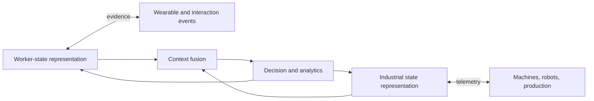

**Caption:** The two representations exchange evidence; neither is assumed to be a complete or clinically valid twin.
**Source:** Author-generated conceptual architecture.

### Figure 7. Context-fusion architecture

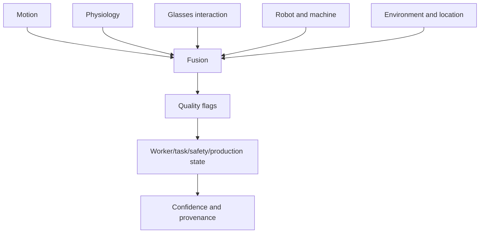

### Figure 8. HMI/HRI feedback loop

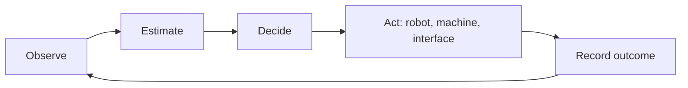

### Figure 9. Worker data to robot decision

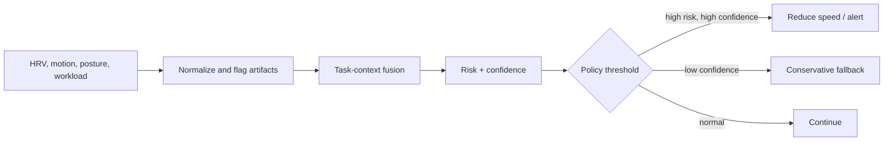

### Figure 10. Experimental evaluation framework

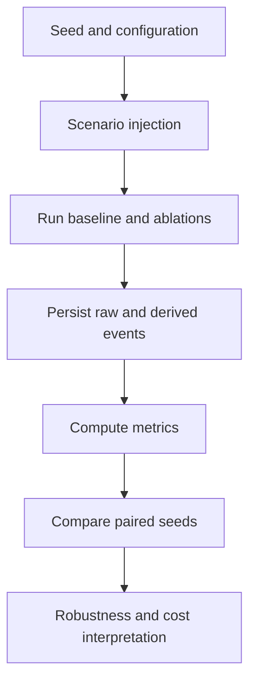

## 11. Database Architecture

The SQLite schema contains `workers`, `wearable_devices`, `wearable_telemetry`, `worker_state`, `machines`, `machine_telemetry`, `robots`, `robot_telemetry`, `departments`, `tasks`, `production_events`, `safety_events`, `context_events`, `factory_state`, and `simulation_runs`. Each event is linked by `run_id`, `cycle`, and timestamp. The schema intentionally stores raw-ish telemetry separately from derived worker state and decision events so that an evaluator can audit how an action was produced.

### Figure 11. Database ER view

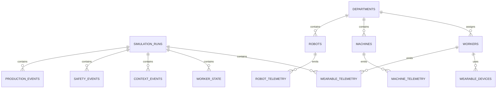

## 12. Dashboard and Smart-Glasses Concept View

The Streamlit application has an interactive Plotly floor plan as its central element. Departments are physical zones and hover details expose worker, robot, risk, and vehicle state. The moving vehicle state is represented by the active stage and the cycle counter; this is proof that the event loop is advancing, not proof of animation fidelity or a real plant.

The dashboard also exposes worker monitoring, robot monitoring, machine state through event records, production counters, alerts, bottleneck department, telemetry charts, periodic analysis, an event log, and a SQL query runner.

### Figure 12. Dashboard architecture

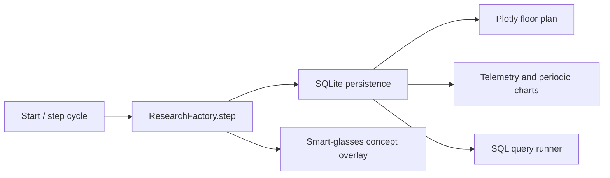

## 13. Failure and Robustness Analysis

The robot policy has explicit fallbacks. Missing packets or absent devices lower context availability and prevent wearable context from being used. Sensor drift reduces confidence. Latency reduces confidence. Machine faults take precedence over wearable adaptation. Safety-zone events can trigger a stop condition in the simulated policy. These are policy-level safeguards, not safety certification.

Failure cases to test include:

- missing wearable data and packet loss
- sensor noise and drift
- incorrect worker location
- incorrect activity classification
- network delay and gateway failure
- database unavailability
- device battery or wearing failure
- robot sensor failure
- conflicting wearable and machine observations

The current prototype injects several data-level scenarios. Database and robot-sensor failures remain extension points for the next implementation pass and must be included before any claim of production readiness.

## 14. Ethics, Privacy, Security, and Governance

Worker physiological and location data can be biometric or highly sensitive even when collected for safety. Safety benefit does not automatically justify continuous surveillance. A responsible deployment should define purpose limitation, informed consent or an appropriate employment-law basis, data minimization, role-based access, retention limits, pseudonymization, worker access rights, and a process for challenging automated inferences.

Risks include discrimination against workers with different baselines or disabilities, pressure to disclose health data, function creep from safety to performance scoring, re-identification, insider access, ransomware, and insecure wearable gateways. GDPR may apply where personal data of people in the European Economic Area is processed. In India, the Digital Personal Data Protection Act, 2023 and applicable rules should be assessed with legal counsel; this paper does not provide legal advice.

Cybersecurity should include device identity, encrypted transport, key management, signed software updates, access logging, network segmentation, and incident response. Safety decisions should fail conservatively and remain auditable. The NIST AI Risk Management Framework is useful for organizing governance, mapping, measurement, and management, but it does not certify this prototype.

## 15. Healthcare Transferability

The hierarchy could support healthcare research, rehabilitation, elderly care, remote monitoring, or clinician assistance as an architectural analogy. Transfer is not automatic. Clinical systems require validated sensors, clinical endpoints, regulated software processes, patient consent, medical-device classification analysis, alarm management, and appropriate standards. A synthetic worker-state estimator or consumer fitness band cannot be presented as a clinical monitor.

## 16. Limitations

1. The generated signals are synthetic and seeded; they are not measurements from workers.
2. The behavioral equations are hypotheses encoded as simulation rules, not validated physiological models.
3. The factory is a discrete event testbed without physical robot dynamics, geometric collision checking, or safety certification.
4. The current dashboard demonstrates cycle progression, not a real network stream or industrial deployment.
5. The literature review is structured and critical but not a registered systematic review with a reproducible screening corpus.
6. The current cost model is conceptual; it does not provide monetary estimates.
7. Smart-glasses usability, acceptance, visual workload, and actual task performance require human-subject experiments.
8. Confounding, fairness, individual calibration, and distribution shift remain open empirical problems.

## 17. Reproducibility

From the repository root:

```powershell
pip install -r requirements-research.txt
python run_research_experiments.py
python -m streamlit run research_dashboard.py
```

The random seed, scenario, mode, cycle, run ID, timestamp, source fields, packet-loss flag, and context-confidence value are stored for audit. The database is local SQLite for portability. A future MQTT or WebSocket adapter should preserve the same event schema and timestamp semantics.

The executable research package is available at [github.com/yashanandingole12-gif/wearable-context-factory-research](https://github.com/yashanandingole12-gif/wearable-context-factory-research). The canonical implementation is `factory_experiment.py`; the dashboard is `research_dashboard.py`; the saved synthetic comparison is `experiment_results.json` when generated locally. The repository also includes `test_research_factory.py` for event-loop, packet-loss, and persistence checks.

## 18. Conclusion

Wearables can plausibly provide additional contextual evidence to HMI/HRI systems, but the evidence does not justify treating them as direct intention detectors, medical instruments, or guaranteed productivity enhancers. The strongest research direction is a controlled, multimodal, uncertainty-aware evaluation of incremental value. The proposed testbed makes that direction executable: it compares a machine/environment baseline with modality ablations and a full condition, injects operational failures, stores provenance, and exposes both real-time and periodic views.

The central scientific contribution is therefore a research protocol and architecture for asking when wearable context is useful, when it is misleading, and whether its operational, privacy, and maintenance costs are justified.

## References

[1] L. Lu, “Industry 4.0: A survey on technologies, applications and open research issues,” _Journal of Industrial Information Integration_, vol. 6, pp. 1–10, 2017. [DOI: https://doi.org/10.1016/j.jii.2017.04.005]

[2] V. Villani, F. Pini, F. Leali, and C. Secchi, “Survey on human–robot collaboration in industrial settings: Safety, intuitive interfaces and applications,” _Mechatronics_, vol. 55, pp. 248–266, 2018. [DOI: https://doi.org/10.1016/j.mechatronics.2018.02.009]

[3] International Organization for Standardization, _ISO 23247-1:2021, Automation systems and integration—Digital twin framework for manufacturing—Part 1: Overview and general principles_, 2021. Available: https://www.iso.org/standard/75066.html

[4] M. Breque, L. De Nul, and A. Petridis, _Industry 5.0: Towards a Sustainable, Human-Centric and Resilient European Industry_, European Commission, Directorate-General for Research and Innovation, 2021. Available: https://op.europa.eu/en/publication-detail/-/publication/468a892a-5097-11eb-b59f-01aa75ed71a1

[5] E. Tabassi, _Artificial Intelligence Risk Management Framework (AI RMF 1.0)_, NIST AI 100-1, National Institute of Standards and Technology, 2023. [DOI: https://doi.org/10.6028/NIST.AI.100-1] [Open PDF: https://nvlpubs.nist.gov/nistpubs/ai/NIST.AI.100-1.pdf]

[6] European Parliament and Council, “Regulation (EU) 2016/679 (General Data Protection Regulation),” 2016. Available: https://eur-lex.europa.eu/eli/reg/2016/679/oj

[7] Government of India, _Digital Personal Data Protection Act, 2023_, Act No. 22 of 2023. Available: https://www.meity.gov.in/

[8] International Organization for Standardization and International Electrotechnical Commission, _ISO/IEC 27001:2022, Information security, cybersecurity and privacy protection—Information security management systems—Requirements_, 2022. Available: https://www.iso.org/standard/27001.html

[9] International Organization for Standardization, _ISO 10218-1:2011, Robots and robotic devices—Safety requirements for industrial robots—Part 1: Robots_, 2011. Available: https://www.iso.org/standard/51330.html

## Editorial Change Log

| Original assumption                                   | Problem identified                                                                       | Evidence/reasoning                                 | Change made                                                                       | Effect on research design                                             |
| ----------------------------------------------------- | ---------------------------------------------------------------------------------------- | -------------------------------------------------- | --------------------------------------------------------------------------------- | --------------------------------------------------------------------- |
| Wearables will improve productivity                   | Earlier simulation showed slower robot speed and more downtime in the wearable condition | Adaptation creates a safety/throughput trade-off   | Productivity is now a hypothesis, not a claim                                     | Results must report safety, quality, latency, and throughput together |
| Physiological values reveal worker intention          | Physiological signals are indirect and confounded                                        | Sensor semantics do not establish intent           | Reframed them as worker-state indicators                                          | Policy uses confidence and fallback                                   |
| The repo was a factory digital twin                   | Existing repo is primarily a smart-glasses assistant; the factory was separate           | Architecture and implementation did not match      | Labelled the system a virtual testbed/twin-like state model                       | Avoids overstated deployment claims                                   |
| A seven-station batch model was sufficient            | User requires logistics, safety, battery, testing, and dispatch                          | Missing process and failure coverage               | Added ten departments and state entities                                          | Enables end-to-end flow and ablation scenarios                        |
| A dashboard alone proves realtime                     | Static charts do not prove a streaming loop                                              | Realtime requires state transition and persistence | Added cycle stepping, SQLite persistence, and event provenance                    | Dashboard is evidence of executed synthetic cycles only               |
| Full multimodal sensing is automatically best         | More data can increase cost, latency, and conflicting evidence                           | Attribution requires ablation                      | Added none/motion/physiology/glasses/full conditions                              | Measures marginal contribution                                        |
| Wearable data can be trusted by the robot             | Packet loss, drift, latency, and device absence are expected                             | Robust HRI requires uncertainty handling           | Added confidence and conservative fallback behavior                               | Failure analysis becomes an explicit experiment                       |
| Context maintenance cost is reduced                   | Sensors can move cost into calibration, privacy, and maintenance                         | Cost is multi-component                            | Added a proposed cost model                                                       | Prevents one-sided economic conclusions                               |
| Smart glasses provide complete factory understanding  | Display and interaction do not establish comprehension or intent                         | Interface capability is not validated cognition    | Added a concept view with explicit scope limits                                   | Requires usability and human-subject validation                       |
| Synthetic outputs could be written like field results | Simulation is not human or industrial evidence                                           | Results policy and reproducibility                 | Marked every output as synthetic and separated expected from measured claims      | Paper becomes scientifically defensible                               |
| A few conceptual references were enough               | Formal claims require traceable sources and standards                                    | Citation quality matters                           | Anchored claims to DOI-linked papers, ISO, NIST, EU, GDPR, and Indian law sources | Literature claims are narrower and auditable                          |
