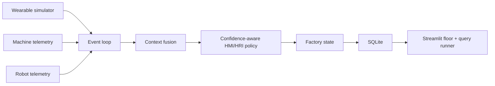

# Wearable Context Factory Research Prototype

This directory contains a reproducible **synthetic** research testbed for wearable-driven HMI/HRI in smart manufacturing. It is not a deployed factory, a clinical monitoring system, or evidence from human participants. The dashboard uses the reference-inspired `factory_layout.svg` as its static floor-plan image and overlays live synthetic state below it.

## Run the experiment

```powershell
python run_research_experiments.py
```

This runs the baseline and four ablation conditions (`none`, `motion`, `physiology`, `glasses`, `full`) plus abnormal scenarios. It writes `experiment_results.json` and persists normalized event data to `research_factory.sqlite`.

## Run the dashboard

```powershell
python -m streamlit run research_dashboard.py
```

Open `http://localhost:8501`.

Use **Start / step realtime cycle** to advance the event loop by one sample. Use **Run 30-cycle periodic analysis** for a batched analysis. The factory floor is the central visualization; Plotly hover details expose workers, robots, risks, and station state. The SQL tab executes read-only or analytical queries against the SQLite database. Do not run destructive SQL in a shared database.

## Controls

- Context condition: machine/environment only, motion, physiology, smart-glasses context, or full multimodal context.
- Scenario injection: fatigue, safety-zone entry, machine fault, workload spike, bottleneck, worker absence, packet loss, sensor drift, and latency.
- Seed: deterministic reproducibility control.

## Data model

The active research dashboard uses one database: `research_factory.sqlite`. It contains `workers`, `wearable_devices`, `wearable_telemetry`, `worker_state`, `machines`, `machine_telemetry`, `robots`, `robot_telemetry`, `departments`, `tasks` (available for extension), `production_events`, `safety_events`, `context_events`, `factory_state`, and `simulation_runs`.

The repository also contains older prototype databases: `factory_hmri.sqlite`, `streamlit_factory_hmri.sqlite`, and `smoke_factory.sqlite`. They come from earlier batch/dashboard experiments and are not used by `research_dashboard.py`; they are retained as historical artifacts rather than silently deleted.

All tables use ISO-8601 timestamps. Event records are associated by `run_id` and `cycle`. Measurements generated by the simulator are explicitly synthetic.

## Architecture



The prototype uses a local event loop rather than MQTT by default so the experiment is reproducible without external infrastructure. MQTT/WebSocket transport can be added as a deployment adapter without changing the event schema.

## Interpretation rules

- Physiological features are modeled as indicators, not direct observations of intention, stress diagnosis, or medical status.
- `context_confidence` is a proposed experimental metric, not a validated universal score.
- A wearable signal is not trusted blindly. Packet loss, missing devices, sensor drift, and latency reduce confidence or trigger conservative fallback behavior.
- Productivity improvement is not assumed. Compare throughput, risk, alerts, defects, and robot intervention rates across repeated seeded runs.
